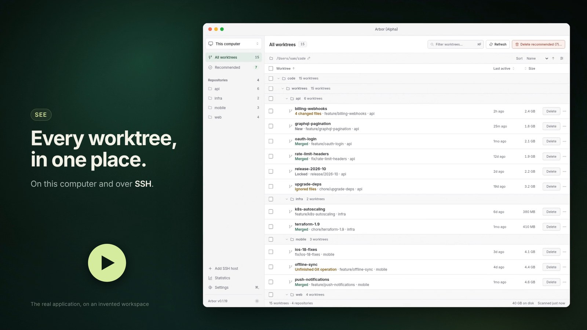

<p align="center"></p>
<h1 align="center">Arbor (Alpha)</h1>
<p align="center">Your Git worktrees, in one place.</p>
<p align="center">macOS · Linux · Desktop app + portable CLI · Local and SSH hosts</p>
<p align="center"><a href="https://github.com/stbenjam/arbor/actions/workflows/ci.yml"></a> <a href="https://github.com/stbenjam/arbor/releases">Download</a> · <a href="#build-from-source">Build from source</a></p>

> **Alpha.** Arbor deletes folders, and it is still changing quickly: behavior, options and the look of the app can differ from one release to the next. Read what a confirmation says before agreeing to it, and keep your work committed or pushed.

<p align="center"><a href="https://github.com/stbenjam/arbor/releases/download/v0.1.19/arbor-promo.mp4"></a></p>
<p align="center"><sub>Arbor in thirty seconds. The application in the film is the real one, on an invented workspace; <a href="promo/README.md">how it was made</a>.</sub></p>

Arbor finds linked Git worktrees and lets you delete them. See where they live, which branch they contain, and when they were last active. Delete one checkout or a folder's worktrees. Ordinary repository checkouts are not listed as cleanup items.

The desktop app uses Electron with a native window, system typography, compact controls, and a Go backend. It loads its interface from the app bundle, communicates with the backend through a narrow local bridge, and does not start a web server or open a browser. The same inspection and cleanup engine is available as a small standalone CLI. No account or hosted service is required. Fetching and GitHub checks are optional.

## Download

Choose an asset from [Releases](https://github.com/stbenjam/arbor/releases). `VERSION` below includes the `v`, for example `v0.4.1`.

| Platform             | Desktop app                          | Standalone CLI                      |
| -------------------- | ------------------------------------ | ----------------------------------- |
| macOS, Apple Silicon | `arbor_VERSION_darwin_arm64.app.zip` | `arbor_VERSION_darwin_arm64.tar.gz` |
| macOS, Intel         | `arbor_VERSION_darwin_amd64.app.zip` | `arbor_VERSION_darwin_amd64.tar.gz` |
| Linux, x86-64        | `arbor_VERSION_linux_amd64.AppImage` | `arbor_VERSION_linux_amd64.tar.gz`  |
| Linux, ARM64         | `arbor_VERSION_linux_arm64.AppImage` | `arbor_VERSION_linux_arm64.tar.gz`  |

Linux also has `arbor_VERSION_linux_ARCH.desktop.tar.gz`, an extracted desktop distribution for environments without AppImage/FUSE support. Keep all of its files together.

The desktop supports **macOS 13+** and modern Linux desktops (Ubuntu 22.04 or newer, or an equivalent distribution). It includes its Electron runtime; Node.js is not required to run it. The standalone Go CLI supports macOS 12+ and Linux, has no GUI runtime dependency, and works on headless SSH hosts.

The machine being scanned needs **Git 2.36+**, for [NUL-separated worktree metadata](https://github.com/git/git/blob/master/Documentation/RelNotes/2.36.0.adoc). Optional GitHub PR status requires the [GitHub CLI](https://cli.github.com/) and `gh auth login` on that machine.

### Homebrew

Install the standalone CLI or the macOS app:

```sh
brew install stbenjam/arbor/arbor
brew install --cask stbenjam/arbor/arbor
```

Arbor is ad-hoc signed, but not yet signed with an Apple Developer ID or
notarized. macOS will refuse to open it the first time. After trying to open
it, go to **System Settings → Privacy & Security → Open Anyway**.
Only approve a download you trust.

Upgrade the installations you use:

```sh
brew update
brew upgrade --formula stbenjam/arbor/arbor
brew upgrade --cask stbenjam/arbor/arbor
```

Uninstall either installation:

```sh
brew uninstall --formula stbenjam/arbor/arbor
brew uninstall --cask stbenjam/arbor/arbor
```

These commands keep your preferences and statistics. To remove those too,
back up your statistics first and use
`brew uninstall --cask --zap stbenjam/arbor/arbor`; this also removes local
statistics shared with the CLI. Repositories, worktrees and remote files
are left alone.

### macOS

Unzip the desktop download, drag **Arbor.app** into Applications, and open it. On first launch, a setup wizard lets you choose this computer or an SSH host, the folder to scan, folders to skip, and optional network checks before any scan starts. Arbor is ad-hoc signed, but not yet signed with an Apple Developer ID or notarized. macOS will refuse to open it the first time. After trying to open it, go to **System Settings → Privacy & Security → Open Anyway**. Only approve a download you trust.

The included backend is also usable from Terminal:

```sh
/Applications/Arbor.app/Contents/Resources/bin/arbor-cli list --path "$HOME/git"
```

For an `arbor` command on your shell's `PATH`, install the standalone CLI as described below. If Git is missing, `xcode-select --install` installs Apple's command line tools.

### Linux

Make the AppImage executable and open it:

```sh
chmod +x arbor_v0.4.1_linux_amd64.AppImage
./arbor_v0.4.1_linux_amd64.AppImage
```

Use the ARM64 asset on ARM hardware. If AppImage cannot mount on your distribution, use the `.desktop.tar.gz` download, extract it, and run `./arbor-desktop` from that folder. Keep its `resources/` directory alongside the executable. Linux desktop builds depend on the standard desktop libraries provided by supported distributions.

### Standalone CLI

Extract the matching CLI archive. It contains a versioned directory; enter
that directory before installing. For example, on Linux x86-64:

```sh
tar -xzf arbor_v0.4.1_linux_amd64.tar.gz
cd arbor_v0.4.1_linux_amd64
```

Use `darwin` for macOS and `arm64` for Apple Silicon or Linux ARM64. Run the
extracted `arbor` directly, or install it from that directory:

```sh
mkdir -p "$HOME/.local/bin"
install -m 755 arbor "$HOME/.local/bin/arbor"
```

For Bash or Zsh, add `export PATH="$HOME/.local/bin:$PATH"` to your shell's
startup file (`~/.bashrc` or `~/.zshrc`) if needed, then start a new shell. For
Fish, run `fish_add_path "$HOME/.local/bin"`. Check the selected installation
with `command -v arbor` and `arbor version`. `arbor list`, `clean`, and `remove` do not require the desktop app. Running `arbor` shows command help; `arbor gui` explicitly launches an installed Arbor desktop app.

### Upgrade and uninstall

To upgrade the CLI, verify and extract the new archive, then repeat the
`install -m 755` command above. Check `command -v arbor` and `arbor version` for
an older copy earlier on `PATH`. The standalone CLI and desktop are separate
installations; replacing one does not replace the other. Quit the desktop
before replacing `Arbor.app`, the AppImage, or the entire extracted Linux
desktop directory. Never mix files from two desktop archives. A new local
release provisions its matching remote CLI on the next SSH operation.

To uninstall the standalone CLI installed above, remove only
`~/.local/bin/arbor`. Remove completion files you installed using
`arbor completion SHELL --help`. For the desktop, quit it and remove
`/Applications/Arbor.app`, your AppImage, or the extracted desktop directory.
These actions leave your repositories and worktrees in place. They also leave
preferences, scan caches and statistics: the desktop's user-data directory is
`~/Library/Application Support/Arbor` on macOS or normally `~/.config/Arbor` on
Linux, and the separate statistics paths are listed under [Statistics](#statistics).
Keep those files if you plan to reinstall; back up statistics before choosing
to remove them. On each SSH host, Arbor's managed CLI cache is
`~/.cache/arbor/bin`; remove it only when no Arbor operation is running there.
Uninstalling the local app does not remove remote files.

### Verify downloads

Every release includes `arbor_VERSION_checksums.txt` with SHA-256 hashes for both CLI and desktop downloads. On Linux, run `sha256sum --check arbor_VERSION_checksums.txt --ignore-missing` from your download folder. On macOS, compare `shasum -a 256 YOUR_DOWNLOAD` with its entry in the checksum file.

## Scanning

Arbor discovers Git repositories beneath your chosen folder and lists their linked worktrees. Both the GUI and CLI omit primary checkouts and bare repositories by default. Ordinary repositories are used to find linked checkouts, but are not themselves fully inspected. A projects folder is usually faster than your entire home folder. Optional fetching and GitHub verification add network work.

The desktop groups worktrees by their actual directories. Each row leads with the worktree's name, then its branch and repository, last activity, and size; the folder rows above it give the rest of its path, which is also its tooltip and one **Copy path** away. A row names the one fact that most affects cleanup, when there is one: **Merged**, **New**, **Locked**, changed files, ignored files, a missing folder, or the reason it cannot be deleted. Green **Merged** marks exactly the rows **Delete recommended** removes. Delete a row, or point at a folder row for its **Delete…**, which deletes the worktrees shown beneath it and keeps the folder itself and anything else in it. To pick your own set, click the rows you want, or the boxes down their left edge, and choose **Delete selected…**. Clicking a row ticks it and leaves the others as they are, and clicking it again unticks it; a folder's box ticks every worktree shown under it, and the box in the heading ticks everything shown. A tick stays when a search, another view or a closed folder takes its row out of the list, so a selection can be gathered over several searches; the selection bar says how many of them are not shown. Deleting several at once, from the selection bar or a folder, first opens a review of every one of them, shown in the list or not: its full path and size, and what deleting it means, whether that is why it is recommended, that its branch keeps what is not merged, what would be discarded, or that it cannot be deleted and is left alone. Where nothing would be discarded, agreeing there is the only question; where something would, the question about discarding is asked once more by name. Right-click a row, or press Enter on it, to copy its path, open it in Finder or a file manager, or open a terminal there. Opening actions are unavailable for SSH worktrees.

**Show Files…** lists ignored files, uncommitted changes and worktree Git data that deletion would discard, grouped by kind and largest first. Click a row's underlined state, or choose **Show Files…** from its menu, a deletion review or a single-worktree confirmation. From a confirmation, the files dialog offers **Delete…** to return to the question. An ignored folder is one line, with its size and file count. Headings count items beyond the displayed list; **at least** marks an incomplete size. Folders can appear under several headings, so sizes are not added together. This works on this computer and SSH hosts.

While it loads, a bar names the current stage: asking Git, looking through the folder with a running file count, then adding up sizes with completed and total entries. Only that last stage has a measured fraction. Closing the list stops the work, locally and over SSH.

Arrow keys move through the list without ticking anything, and Enter opens a row's actions. Space ticks or unticks the row the cursor is on, as clicking it does, and Shift with an arrow key or a click ticks every row from the one the cursor is on. Ticking a row never unticks another; Escape unticks everything. Delete removes what is ticked, or the row the cursor is on when nothing is, after confirmation. Tab moves between the list and its folders rather than through every row's buttons, and when a row is deleted the keyboard stays on the row that takes its place. Page Up and Page Down move by a screenful. `/` or Ctrl/Cmd+F focuses the filter, which also finds rows by what they say their state is, such as "ignored"; Down from the filter goes to its first result. The boxed **Sort**, **State** and **Last active** menus show their hover and keyboard focus states. **State** and **Last active**, beside Sort, narrow the list together with search and the current view without clearing ticks; State counts each row by its leading state, and Last active leaves out unknown activity when an age is chosen. Choose **Not for a week**, **Not for a month**, **Not for 3 months**, or **Not for a year** (7, 30, 90, or 365 days); these filters are not remembered after restarting. The sort menu's arrow button reverses the order, as clicking a column heading does. Sorting by size or by last activity orders the folders as well as the rows in them, by the largest or the longest-idle worktree anywhere beneath each, so the first row is the largest or the stalest there is. In a window too narrow for the **Last active** and **Size** columns, each row's second line ends with them.

The desktop scans in the background, with independent progress and **Stop** controls for each host. Previously checked worktrees remain usable during a refresh; newly discovered rows show pending checks until their scan completes. Deleting a checked worktree stops and settles a refresh on that host before removing the selected target. Scans on other hosts continue. Stopping a scan keeps its previous checked results and any incomplete discoveries visible; incomplete discoveries cannot be deleted until checked.

Setup and **Settings** include an editable **Folders to skip** list, folded away until opened. Defaults skip directories named `.cache`, `.Trash`, `node_modules`, `tmp`, and `temp`, plus `~/Library/Caches`, `~/Library/Logs`, `~/.local/share/Trash`, `~/.codex/.tmp`, and the rootless container image stores `~/.local/share/containers` and `~/.local/share/docker`, which can hold tens of thousands of directories and no worktrees. Real Codex-managed worktrees in `~/.codex/worktrees` are still included. An unmodified default list gains new default exclusions on upgrade; custom lists, including a default list you trimmed, remain unchanged.

Enter one directory name, path, or glob pattern per line. Patterns are case-sensitive: `*` matches characters within a directory name, `?` matches one character, `[abc]` or `[a-z]` matches a character class, and a whole `**` path component matches zero or more directory levels. A single-name pattern matches directories anywhere below the selected root; a relative path pattern is anchored to that root, and an absolute or `~/` pattern is anchored to that machine's filesystem or home folder. Matching a directory excludes its subtree. Use `~/.codex*/.tmp` to skip temporary folders under both `.codex` and alternate Codex home names; use `**/build` for build folders at any depth. Backslash escapes a literal wildcard. Brace expansion and `!` negation rules are not supported. The explicitly selected root itself is always scanned. Clear the list to disable exclusions.

### Ignored files considered safe to delete

Settings, beside **Folders to skip**, has **Ignored files considered safe to delete**. Enter one name, worktree-relative path or glob per line; **Restore defaults** restores the list, and clearing it disables it. Names match files or folders at any depth; paths start at the worktree’s top. Matching is case-sensitive and supports `*`, `?`, `[a-z]`, backslash escapes and whole-component `**`, like Skipped folders. Each ignored entry is matched exactly as Git reports it: an ignored folder is one entry, so `node_modules` covers `node_modules/`, but `node_modules/*` does not. Absolute and home-relative paths are not accepted here.

The defaults are `node_modules`, `.venv`, `venv`, `__pycache__`, `*.pyc`, `.pytest_cache`, `.mypy_cache`, `.ruff_cache`, `.tox`, `.gradle`, `.next`, `.nuxt`, `.turbo`, `.cache`, `coverage`, `.DS_Store`, `dist`, `build`, and `target`: disposable install/build output, tool caches and OS metadata. They never include secret/configuration patterns such as `.env`, `.env.*` or `*.local`, editor folders, databases, keys, credentials or logs. Customize rules to fit what your projects actually keep in these folders.

When every ignored entry is covered, ignored files no longer prevent a clean deletion or, when merged, a recommendation. Rows say **Ignored files marked safe**; their tooltip and the deletion review name the matching rules. **Show Files…** groups ignored entries under **Needs review** first, followed by **Considered safe by your settings**. This waives only the ignored-file loss: changes, unchecked files, nested repositories (even inside `node_modules` or `.venv`), and all other checks still apply. JSON retains `ignored: true`, adds `allIgnoredSafe` and `matchedSafeIgnored` (at most 128 rules), and file entries add `safeIgnored` and `safeIgnoredRule`.

**These files are deleted permanently. Undo and Restore do not bring them back.**

The CLI uses the same defaults. **`arbor clean --yes` now deletes otherwise eligible merged worktrees whose ignored files are all covered, without `--force`.** `--safe-ignored RULE` adds a rule (repeatable); `--no-default-safe-ignored` leaves the defaults out. Both work on `list`, `clean`, `remove` and `files`, locally and over SSH. For example, `arbor list --path ~/code --no-default-safe-ignored --safe-ignored node_modules --safe-ignored "**/generated"`. Removal checks the worktree afresh using the same rules; an uncovered file appearing after the scan prevents an unforced deletion. The desktop passes its complete per-host list for every scan, deletion and file inventory.

Skipped folders also omit registered worktrees inside them. They only affect what is searched: files inside a listed worktree are still measured, and are deleted with it. On an SSH host the rules are resolved on that host.

**Settings** stays pinned below the scrolling repository list. Scan settings apply with **Save & scan**, for the host shown; edits to one host are kept while you look at another's, and a host still holding unsaved edits is shown next rather than dropped. Settings stays open until the scan has been taken up, so one that is refused is put right where it was typed, and a folder on this computer that does not exist is refused before anything is saved. While the host being edited is still scanning, Settings has its own **Stop scan**, and keeps what was changed. Appearance applies as soon as it is chosen. The button beside the version switches light and dark; from System it chooses the opposite of what is showing. Settings also offers System. To start over, choose **Settings → Reset to defaults…** and confirm. Arbor stops any active scan, clears its saved settings and scan results, and reopens setup. It does not delete repositories, worktrees, SSH configuration, or cleanup statistics. Reset is unavailable while worktree cleanup is running.

Arbor remembers each host's last scan across host switches and app restarts, and with it how the list was sorted and which machine was showing; a search and a selection are not carried over. With no SSH host added there is only this computer: the switcher says **This computer**, and the list starts at its folders. Once a host is added, **All hosts** combines them into a host → directory → worktree tree; the sidebar dropdown filters it without scanning or cancelling background work. **Manage hosts…** at its foot opens host names, removal and adding. When adding an SSH host, **Display name (optional)** lets you use a name such as “Work laptop” instead of `user@hostname`. Edit a saved host’s name in that list; clearing it uses the SSH host again. Display names are saved separately from the SSH address. In All hosts the folder control is hidden; choose one machine to change its folder. Saved results appear immediately, marked with the time they were scanned, and unscanned hosts scan in the background (up to three at a time). After an hour, the list offers **Refresh** above its rows, including while the window stays open or returns to the front. In All hosts, the oldest scan decides. Dismiss the notice for that scan; Arbor never refreshes it on its own. **Refresh** scans the selected host, or all idle hosts in the combined view. Settings has its own host selector for editing one host's scan options. A host that cannot be reached is reported once, in the banner, and counted in the status bar; the other hosts' results stay usable. Deletion always rechecks the selected worktree before touching it.

Drag the sidebar’s edge to resize it (160–320 pixels), double-click to reset, or use arrow keys on the separator. **Ctrl/Cmd+B**, **View → Toggle Sidebar**, and the toolbar button hide or show it. Its width and visibility are remembered; the toolbar button and application menus stay reachable while it is hidden.

Click outside a dialog to do what Escape does, including cancelling a deletion review without deleting anything. Dragging from inside leaves it open; required setup stays open.

## Statistics

Open **Statistics**, pinned beside Settings, for lifetime cleanup totals and 30-day charts: worktrees deleted, estimated space recovered, cleanups, largest worktree, and average worktree size. Each chart is labelled with its scale; point at a day, or move to a chart with Tab and use the arrow keys, to read that day's figure. Successful deletions from both the desktop app and CLI count. Missing checkout registrations count as cleanups but recover zero bytes; disk space is an estimate, not a measurement of free space.

Statistics belong to each host. The **All hosts** view combines their totals and charts; filtering to one host shows only its history. When a host cannot be reached, the totals say they are partial before any number is shown. Local app and CLI share one store; an SSH host keeps its own totals, including cleanups run directly on that host. View them from the terminal with `arbor stats`, `arbor stats --json`, or `arbor stats --host my-vps`.

Only aggregates and 90 days of daily totals are stored, with no worktree path history, in `arbor/statistics.json` under the operating system's user configuration directory. Writes are atomic and process-locked. Unreadable statistics are preserved in a recoverable `.corrupt-*` backup before recording new totals. Resetting preferences keeps statistics.

On macOS the statistics file is `~/Library/Application Support/arbor/statistics.json`; on Linux it is `${XDG_CONFIG_HOME:-$HOME/.config}/arbor/statistics.json`. To start totals over, close Arbor and any CLI cleanup, then move that file aside as a backup. The desktop scan cache is `workspace-cache.json` in Electron's `Arbor` user-data directory (`~/Library/Application Support/Arbor` on macOS, normally `~/.config/Arbor` on Linux).

## CLI

```sh
# Show useful help without opening the app or scanning anything.
arbor
arbor help list
arbor list --help

# Explicitly open the installed desktop app.
arbor gui --path "$HOME/git"

# Discover local worktrees. The default path is your home directory.
arbor list --path "$HOME/git"
arbor list --path "$HOME/git" --json
arbor list --path "$HOME/git" --recommended
arbor list -p "$HOME/git" -q  # quiet: omit human progress

# Add an exclusion, or replace the default exclusion list.
arbor list --path "$HOME/git" --exclude archives
arbor list --path "$HOME/git" --no-default-excludes --exclude node_modules
arbor clean -p "$HOME/git" --exclude 'archives,old'  # commas are literal

# Quote globs so Arbor—not your shell—matches them, including on SSH hosts.
arbor list --path "$HOME" --exclude '~/.codex*/.tmp'
arbor list --host my-vps --exclude '**/build'

# Human scans show progress on stderr. JSON output is quiet unless requested.
# Stream machine-readable progress to stderr; the final JSON stays on stdout.
# For remove and clean it follows each folder as it is deleted, file by file.
arbor list --path "$HOME/git" --json --progress

# Explicitly refresh remote refs and check GitHub pull requests.
arbor list --path "$HOME/git" --fetch --github

# Show older worktrees, least recently used first; use size for largest first.
arbor list --path ~/code --older-than 30d --sort activity
arbor list --path ~/code --sort size --strict --json

# Preview cleanup; --yes is required to remove anything.
arbor clean --path "$HOME/git"
arbor clean --path "$HOME/git" --fetch --github --yes
arbor clean --path ~/code --older-than 30d --sort size  # preview
# For cron, use an absolute CLI path and keep stderr in the job log.
arbor clean --path ~/code --older-than 30d --yes

# See what deleting one worktree would discard, without changing it.
arbor files /absolute/path/to/worktree
arbor files /absolute/path/to/worktree --limit 20 --json
arbor files /absolute/path/to/worktree --json --progress # progress on stderr
arbor files /missing/worktree --repo /path/to/repository
arbor files --host my-vps -- '~/projects/worktree'

# Remove one worktree; its local branch is kept.
arbor remove -- /absolute/path/to/worktree  # preview, including what --force would discard
arbor remove /absolute/path/to/worktree --yes

# Put a deleted checkout back; its parent must exist and PATH must not.
arbor restore /absolute/path/to/worktree --repo /path/to/repository/.git --branch topic
arbor restore /absolute/path/to/worktree --repo /path/to/repository/.git --detach COMMIT
arbor restore /absolute/path/to/worktree --repo /path/to/repository/.git --branch topic --head COMMIT --host my-vps --json

# Like git worktree remove, --yes alone refuses a worktree with local files or
# a lock. --force discards them, and removes detached, missing or empty ones.
arbor remove /path/to/worktree --force --yes
arbor remove /missing/worktree --repo /path/to/repository --force --yes

# Delete the clean linked worktrees beneath a folder, merged or not.
arbor clean --path /absolute/path/to/old-sessions --all       # preview
arbor clean --path /absolute/path/to/old-sessions --all --yes # execute
# ...and the ones with local files, locks, or a detached HEAD as well.
arbor clean --path /absolute/path/to/old-sessions --all --force --yes
arbor version
arbor --version
```

The CLI uses Cobra for command-specific help, argument validation, typo suggestions, and shell completion. Run `arbor help COMMAND` or `arbor COMMAND --help` for flags and examples. Help never scans or launches the desktop. Flags can appear before or after a positional worktree path; use `--` before a path beginning with `-`. Short forms include `-p` for `--path`, `-y` for `--yes`, and `-q` for `--quiet`.

`--path` scopes discovery and cleanup: only linked worktrees inside that folder appear. `arbor list --linked-only=false` additionally includes primary checkouts and other registered worktrees for diagnostics, not deletion. Repeat `--exclude` to add multiple rules; each argument is one literal pattern, so commas are not separators. Both `list` and `clean` accept exclusions.

Human-readable output names the scanned folder once and lists each worktree's path beneath it, with branch, repository, last activity, size, and status, and explicitly says when no worktrees match. In a terminal, paths and branches keep both ends when shortened to fit the width; below 60 columns (or when diagnostics cannot fit), entries use blocks of lines. `COLUMNS` overrides the detected terminal width, with 100 columns as the fallback. Redirected output is never shortened, and `--json` has every value in full. Sizes use the desktop's 1024-based B/KB/MB/GB/TB units and rounding (for example, `3 MB` or `1.2 GB`), with English number formatting. A clean checkout whose commits are not known to be merged is labelled `not merged`; `merged`, `new`, and `local changes` retain their meanings. A closing list summary gives the displayed count and size, plus the recommended count, size, and a cleanup command when there are recommendations. Filtered nonempty lists say how many of the scanned worktrees are shown. Human scans announce their start and completion on stderr, with additional progress when they take longer than a moment; `--quiet` suppresses it. `--json` writes only the result to stdout; add `--progress` for newline-delimited `@arbor-progress ` JSON events on stderr. Removal and cleanup preview by default, with the total size on disk and, per path, what `--force` would discard; `--yes` is required to delete anything, and never discards local files by itself. Scan warnings and skipped worktrees from `clean` and `remove` always go to stderr, including with `--json`, so an incomplete scan never looks like a folder with nothing to clean; a JSON preview also carries the scan warnings as `warnings`.

`files --progress` reports `files-git`, `files-search` (files visited in `discovered`), and `files-measure` (entries processed in `completed` of `total`). SSH also reports `connecting`. Unknown totals are zero. Progress never changes the JSON inventory on stdout; without the flag, files progress is silent.

### Scripting and exit status

Use `--json` rather than parsing the human table. There is no interactive CLI
confirmation: `clean` and `remove` exit after a preview; Enter does not approve
it. Adding `--yes` runs a new inspection and selection. A previous preview is
not a saved deletion plan, and newly recommended worktrees can join a later
`clean --yes`. For a particular reviewed checkout, `remove PATH --head COMMIT
--recommended-only --yes` requires that commit and a fresh recommendation.

| Invocation with `--json` | stdout on success |
| --- | --- |
| `list` | Object: `root`, `scannedAt`, `durationMs`, `worktrees`, `warnings`, `github`, `fetched` |
| `clean` or `remove PATH`, without `--yes` | Object: `dryRun: true`, `worktrees`, `warnings`, `requiresForce` |
| `clean --yes` | Array of removal results, including failures; empty when nothing matches |
| `remove PATH --yes` | One removal result object |
| `restore PATH` | Object: `path`, `branch`, `head`, `restored`, `moved`, `error` |
| `stats` | Statistics object with `version`, lifetime counters, `daily` entries and optional timestamps/`warning` |

A removal result has `path` and `removed`, with `error` on failure and optional
`retainedBranch` when a recovery branch was created. A partially failed batch
can still print valid JSON before exiting unsuccessfully. Validation or scan
failure can leave stdout empty: check the exit status before parsing it.

Worktree objects carry the table's full `path`, `branch`, `repo`, `activityAt`
and `sizeBytes`. `recommended` is the cleanup decision; `merged` alone is not.
`mergeReason` and `defaultRef` explain merge evidence; `fresh`, `locked`,
`lockReason`, `dirty`, `changedFiles`, `ignored`, `detached`, `missing` and
`empty` explain common exceptions. `canRemove`, `canDiscard`, `losses`,
`discardWarnings`, `blockers` and `problems` describe removal constraints.
Identity and commit metadata are `id`, `commonDir`, `head`, `subject`, `author`
and `commitAt`. Other diagnostics include `main`, `bare`, `outsideRoot`,
`upstream`, `ahead`, `behind`, `published`, `publishedRefs`, `githubState` and
optional `pr` (`number`, `url`, `title`, `state`, `merged`). Times are RFC 3339
strings; unavailable times can be the zero date (`0001-01-01T00:00:00Z`).
Collection fields can be empty or null; consumers should tolerate both and
ignore unknown fields. The scan/removal format has no schema-version field;
check scripts when upgrading this alpha. A missing checkout's size is not
reclaimable space.

Exit status is **0** for success (including no matches and previews), **1** for
failures while working (scan errors, refused removals, and partial deletion),
**2** for usage errors (unknown flags, invalid values, argument counts, or
conflicting flags), **3** for an incomplete scan with `list --strict` or
`clean --strict`, and **130** when interrupted. Boolean and duration value
errors name the expected input, for example `--json takes true or false, not
"maybe"`.

`--strict` prints the normal output, then returns 3 if the scan has warnings
or any worktree has `problems`, even if filters hide that worktree. Without
`--strict`, those diagnostics can accompany status 0. Strict mode reports scan
completeness; it does not prevent `clean --yes` from removing selected
worktrees. A scan/removal failure still returns 1, and interruption returns
130. JSON `list` carries warnings in stdout; cleanup
also prints scan warnings to stderr. `--quiet` hides human progress, not results
or warnings. `--progress` explicitly enables framed JSON events on stderr.
Output has no ANSI color escapes, including in a terminal; `NO_COLOR` needs no
special handling.

For example, with `jq` installed, save and check a report before producing
NUL-separated paths for `xargs -0` or `fzf --read0` (paths may contain newlines):

```sh
arbor list --path "$HOME/git" --strict --json > worktrees.json &&
  jq -j '.worktrees[] | select(.recommended) | .path + "\u0000"' worktrees.json
```

Both `list` and `clean` accept `--older-than DURATION`: positive fixed-length
days (`30d`), hours (`12h`), weeks (`2w`), or Go durations (`1h30m`). Activity
must be known and at or before the cutoff calculated when the command starts.
Unknown activity never matches. The filter only narrows the normal selection,
including with `--all` or `--force`. During `clean --yes`, each fresh removal
inspection must still meet the same cutoff; a newly active worktree is skipped
with a reason and the command returns 1. This also applies over `--host`.
The check narrows the race with concurrent work but does not lock out other
processes.

`--sort name|size|activity` orders lists and cleanup previews, including JSON.
The default `name` retains repository/path order; `size` puts the largest
first, and `activity` puts the oldest known activity first, with unknown times
last. Ties retain the default order. Sorting does not alter removal selection.

For example, preview old recommendations before scheduling their cleanup:

```sh
arbor clean --path ~/code --older-than 30d --sort activity
arbor clean --path ~/code --older-than 30d --yes
```

Use an absolute CLI path and an explicit scan path in cron; keep stderr in its
log. There is no built-in NUL-output mode; use JSON as above for unusual paths.
The CLI has no man page; command help is available offline with
`arbor help COMMAND`.

### Shell completion

Generate completion for Bash, Zsh, Fish, or PowerShell:

```sh
arbor completion bash
arbor completion zsh
arbor completion fish
arbor completion powershell
```

Run `arbor completion SHELL --help` for installation instructions for your shell. Generating completion does not scan repositories or require the desktop app.

## SSH hosts

Add an SSH host in the app, choosing the folder to scan on it, or use `--host` in the CLI. Arbor detects the remote OS and architecture, downloads the matching CLI for its own release from GitHub, verifies the release SHA-256 checksum, and installs it under the remote user's `~/.cache/arbor/bin/`, publishing it there only after the transfer is complete and the executable runs. Subsequent connections reuse the managed executable, and installing a newer release there removes the builds of earlier releases that nothing has used for two weeks. No manual remote app installation, desktop runtime, background service, or listening port is needed.

```sh
arbor gui --host my-vps
arbor list --host my-vps --path /home/dev/projects --json
arbor clean --host my-vps --path /home/dev/projects
```

`--host` accepts an SSH config alias or `user@hostname`. Configure custom ports and identity files in `~/.ssh/config`, and successfully connect with ordinary `ssh` first. Arbor uses existing keys, your agent, and verified host keys; connections are noninteractive, so a host that would prompt for a password or a host key cannot be used. A connection failure says which of those it was. An omitted remote path defaults to the remote user's home. Quote a remote home path, for example `arbor list --host my-vps --path '~/projects'`: an unquoted `~/projects` is expanded by your local shell before Arbor sees it.

Both macOS and Linux support ARM64 and x86-64. Git must be installed remotely; install and authenticate `gh` remotely for GitHub checks. Provisioning needs a published release matching the local Arbor version. An unversioned `dev` CLI build cannot provision a remote host.

## Cleanup behavior

Recommendations require evidence of a merge and a fully inspected, removable worktree. A branch is merged when the default branch has its commits, or when the same changes were made there under other commits: a copy of each one (a rebase or cherry-pick), or all of them in one (a squash), which the row then names. `git cherry` finds the commits that might be the same, and since it passes over white space, which can be the whole of a difference, each is then confirmed by a comparison that passes over nothing but line numbers. A squash is still found after the default branch has gone on to change the same lines; like a branch that is an ancestor, it says the change was made there, not that nothing has changed since. Nothing is written to the repository to find this out. It needs Git 2.39 on the machine being scanned. A branch that left the default branch more than 20,000 commits ago, one in a partial clone, and one with a merge commit that holds changes of its own unless it was squashed whole, are not found this way. Arbor can also query GitHub PR metadata when enabled, which finds merges this clone has not fetched or cannot match for itself.

One remote decides what is merged: `upstream` when the repository has one, otherwise `origin`. Its default branch is the one it names as its HEAD, or else its `main`, `master`, or `trunk`. **Fetch** also asks that remote again, so a renamed default branch stops deciding what is merged. When that remote cannot say, nothing in the repository is recommended and a scan warning says why: an `upstream` that was added and never fetched, a default branch that has been pruned from this clone, or one this clone does not fetch at all. Another remote's branches, a local branch, or a pull request do not answer for it. In the last case, or when the remote's answer could not be written where Git keeps it, Arbor records the branch's name in the repository's own Git configuration (`arbor.<remote>.head`), because Git keeps no selector for a branch that is not there. The record only withholds: while it is there, later scans and removals recommend nothing in that repository, even after the branch has been fetched, until a scan with **Fetch** on has asked the remote again. A repository with no such remote, and a bare clone, which keeps `origin`'s branches as its own, use their own `main`, `master`, or `trunk`. A merged pull request counts only when it was merged into the deciding remote's default branch on GitHub: one merged into your fork's own branch has not landed upstream. A linked checkout of the branch GitHub names as the default is protected as one, whatever local refs say.

A worktree created in the last 24 hours whose HEAD has never moved is **New**, not recommended: its branch is an ancestor of the default branch only because it still points at its starting commit, and it may be a checkout you or a coding tool just started using. It becomes a recommendation once its HEAD has moved to merged work or its creation is at least a day old, and can be deleted manually at any time. This is a narrow guard for a checkout that was only just created, not a test of whether a worktree is in use: any movement of HEAD counts, including a pull or rebase that adds no commits of your own. A repository that keeps no HEAD reflog offers no creation time, so the rule does not apply there.

Remote-tracking refs are local snapshots: the CLI's `published` metadata means a remote-tracking ref contains the current commit; it does not prove the remote currently has it. Use **Fetch** to refresh refs and **GitHub** to query PR status. Failed network checks do not count as merge evidence.

Manual Delete can remove any linked worktree Arbor can make sense of. Rows name what deletion would discard, and the confirmation names those losses briefly. Uncommitted changes and ignored files are ordinary losses; repositories and commits that could exist nowhere else have separate permanent-loss lines. That covers uncommitted and untracked files, ignored files, files Git was told not to look at, submodule checkouts and what Git keeps for them (even after the worktree's folder is gone), an unfinished rebase, merge or sequence of cherry-picks, another repository inside the folder, and refs of the worktree's own. The last four can cost commits or a whole repository that exist nowhere else. In the app, what is agreed to is what the question named, kind by kind: Arbor looks through the folder once more just before deleting it, and if it finds a kind of loss that the question did not name, a file made since the list was read as much as a repository, the deletion stops, the row is looked at again, and the next question names it. On the command line `--force` agrees to whatever files are there at that moment, and to the last four by name. As with everything else it checks, that look narrows the gap to moments rather than closing it. What Arbor names is what it looks for. It does not search for commits that only the worktree's own reflog or its private refs (`refs/worktree/…`) still point to, or for changes that were staged in a worktree whose folder has since been deleted by hand; removing a worktree drops those, as `git worktree remove` does. A lock, a detached HEAD, and a checkout of a default or protected branch need the same confirmation but lose nothing. Folder deletion applies to the worktrees matching the current filters, including collapsed children. **Delete recommended** deletes nothing by itself. It opens a list of exactly what it would delete, which is the recommendations the list currently shows, so its count follows the repository and search filters as the list does. Each worktree there has its branch, repository and size, and the reason it is recommended: the branch all of its commits are already in, or the pull request that merged it. **Delete** in that list deletes them; Cancel, Escape or closing it deletes nothing, and a double-click or a held key on the way in answers nothing. The list is the one you read. A worktree that changes while it is open is marked and left alone, and one that becomes a recommendation meanwhile waits for the next time.

The CLI shows a preview unless `--yes` is supplied. As with `git worktree remove`, `--yes` alone refuses a worktree that has uncommitted, untracked or uncovered ignored files, or a lock; `--force` is agreeing to everything the preview lists: it discards those files, overrides the lock, and is what removes a detached, missing or empty checkout, a linked checkout of the default branch or of `main`, `master`, `trunk` or `develop`, and a worktree with submodule checkouts, an unfinished Git operation, or another repository inside it. Run without `--yes` first to see what that is. `arbor clean` removes only recommendations; `--all` adds clean worktrees that are not merged, and `--all --force` adds the rest.

Removal uses Git's worktree removal command and retains named branches. Detached commits not already reachable from a local or remote-tracking branch are saved on an `arbor/retained/…` recovery branch; CLI results include its name. Arbor checks the exact target again before deletion, including its commit and branch. Because inspecting a large checkout takes long enough for it to change, the last step before Git removes the folder confirms it is still the same folder at the same commit and branch. That narrows the window to moments but cannot close it: Arbor does not lock other Git processes out of a worktree, so do not delete one that something is committing to right then. It never deletes primary repositories or follows a changed path. Only a checkout Arbor cannot make sense of is refused outright: one whose status, index or Git metadata cannot be read, or whose path it cannot tie to the repository. There it would be guessing what it deleted.

A sparse checkout is treated like any other worktree: the files it skips are not in the folder, so nothing in them can be lost and Git's status still vouches for the rest. A tracked file that is on disk but that Git was told not to look at (`git update-index --assume-unchanged` or `--skip-worktree`) is different, because it can hold a change no status reports. Such a worktree is shown as **Unchecked files** and never recommended; like other local work, it is deleted only through the discard confirmation or `--force`.

Missing checkout registrations, including locked ones, can be removed individually; Arbor does not run a global prune. An empty leftover directory with no Git pointer can also be removed explicitly, but only while it remains empty. Neither case removes unrelated registrations. For a missing path outside its repository, supply `--repo` so the CLI can locate the registration without a broad scan.

While worktrees are deleted, the progress row says which one it is on, with a bar, how many of that worktree's files are gone, and one that is going. Git still does the deleting; Arbor only watches the folder empty. Successful deletions disappear from the existing list immediately, with a notice of how many went and about how much space they held; cleanup does not launch a new full scan. A failed deletion stays visible with its error and refreshes only that worktree so it can be retried. If that inspection also fails, its menu offers **Check again**. A full refresh is explicit. A long deletion has a **Stop** beside its progress: Arbor finishes the worktree it is on, since half of one is worse than either, and leaves the rest as they were. Quitting cancels a scan; during deletion, Arbor can finish the current worktree and quit without starting the remaining deletions. The Git command that deletes a worktree is given as long as it takes and is not interrupted, by Stop, by quitting, or by Ctrl-C at the command line.

A worktree with a read-only folder in it, such as a Go module cache, or inside a folder that is itself read-only, is refused whole before anything is touched, with what to do about it: Git would otherwise delete what it could, forget the worktree, and leave a folder nothing lists any more.

A deleted worktree is not moved to Trash, but it can be put back: deleting keeps its branch, so every commit is still there. After a deletion in the desktop app, the notice has an **Undo** for 12 seconds, which puts each worktree back where it was, on its branch. **Recently deleted**, beside Statistics and in the File menu, lists what this app deleted in the last 30 days, up to 200 worktrees, on this computer and on SSH hosts, and has a **Restore** for each; the list is kept across restarts in `recent-deletions.json` beside the desktop scan cache (statistics remain totals only). A registration whose folder was already gone is not listed, there being nothing to put back. Files that were never committed, untracked and ignored files among them, do not come back, and the app says so when it restores a worktree that had some.

From the terminal, `remove` and `clean` print the command that puts back what they deleted: `arbor restore PATH --repo REPOSITORY --branch BRANCH`, or `--detach COMMIT` for a worktree that was on no branch. `--repo` is the repository's folder or its `.git` folder. Nothing is overwritten: the path must not exist, the folder it is in must, and the branch must exist and not be checked out somewhere else. The branch is checked out as it is now; with `--head COMMIT`, the result says whether it has moved since. Hooks are not run and nothing is fetched. A repository that names its own filter programs is not restored, and neither is a worktree of a partial clone whose files are not all there already; the `git worktree add` command to run yourself is given instead. Standard Git LFS is allowed. If writing the files fails part-way, what was written is left where it is and the message says so. What comes back is the committed files: not discarded work, the worktree's own configuration, or its lock.

Looking at a worktree runs nothing that its repository names. Hooks and the file-system monitor are switched off for Arbor's Git commands, and so is every filter program named in the configuration of a repository or of one of its worktrees, which Git would otherwise run to compare a changed file with what is committed. Git LFS, named as `git lfs install` names it, and filters from your own Git configuration outside the repository still run. With a filter off, Git compares a file it would have rewritten as it lies, and a changed file can look unchanged as easily as the other way about. So a worktree whose configuration names such a filter is shown as **Unchecked files** and is never a clean delete, and the scan says which filters it left off. A submodule's own filters are beyond this: Git runs them itself when it looks inside a submodule.

A worktree whose path is not valid text (UTF-8), and one Arbor cannot tie to its repository, are listed and never offered for deletion. A worktree with refs of its own under `refs/worktree`, which Git deletes with it, is not a clean delete, whether its folder is still there or not: like a nested repository, those refs are a loss that has to have been shown and agreed to by name. `arbor remove PATH` refuses a path that is itself a symbolic link, and names where it leads.

**Last activity** is estimated from the commit, worktree file modification times, and Git metadata. **Disk usage** counts regular checkout files, not shared Git objects, and is not an exact promise of reclaimed space. Discovery does not follow directory symlinks. Permission problems and incomplete scans are reported.

## Build from source

Install **Go 1.24+**, **Node.js 22.12+**, Git, and Make. The same commands work on macOS and Linux:

```sh
git clone https://github.com/stbenjam/arbor.git
cd arbor
npm ci
npm start
```

`npm start` builds the Go companion and icons automatically, then opens the desktop app. There is no renderer bundler or framework build step. All assets are local. `npm run desktop:dir` builds an unpacked desktop distribution in `dist/`.

```sh
make build                            # standalone Go CLI in bin/arbor
make install                          # install CLI into ~/.local/bin
make check                            # Go vet and race tests
npm run test:desktop                  # backend/desktop bridge tests
make package VERSION=v0.4.1            # standalone CLI archives, all 4 platforms
make desktop-package VERSION=v0.4.1    # desktop app for this OS + architecture
```

CLI packaging needs Go and `tar`, can cross-compile all four targets from either OS, and keeps `CGO_ENABLED=0`. Desktop packaging uses pinned Electron/electron-builder dependencies, builds the matching Go companion, and produces a macOS `.app.zip` or Linux AppImage and desktop archive. Build macOS packages on macOS. Outputs go into `dist/`.

The release tag is embedded in the backend (for example `v0.4.1`) and the corresponding numeric version in the desktop app (`0.4.1`). Set `ARBOR_VERSION=v0.4.1` for direct npm packaging commands; otherwise the version comes from `package.json`.

## Code organization

Each layer owns its state and exposes commands or snapshots to its callers:

| Layer | Responsibility |
| --- | --- |
| `internal/worktree` | Scan preparation, repository registration collection, bounded inspection workers, checkout evidence, typed removal decisions, and process-owned cleanup locks. Removal takes named options and rechecks its target. |
| `internal/engine` | The same scan/removal contract locally or over SSH, with separate transport, provisioning, download coordination, and archive verification. |
| `cmd/arbor` | Cobra input, pure request normalization and target selection, batch execution, result presentation, and per-machine statistics recording. |
| `internal/stats`, `desktop/workspace-cache.cjs` | Aggregate cleanup history and reusable scan snapshots, respectively. Neither owns deletion policy. |
| `desktop/backend.cjs`, `desktop/live-worktrees.cjs` | One host's operation lifecycle and snapshots, and the rows shown while its scan is still running. Callers issue commands rather than mutate Backend state. |
| `desktop/workspace-coordinator.cjs`, `desktop/host-scheduler.cjs`, `desktop/workspace-snapshot.cjs` | Host routing and lifecycle, bounded background scheduling, and host-scoped identities/revisions and combined reports. Filtering never performs I/O. |
| `desktop/main.cjs` | Electron composition. IPC, application/context menus, native window lifecycle, and subprocess execution have separate adapters. |
| `desktop/preferences-store.cjs` | Serialized preference persistence with one scan-settings writer, including remembered host roots. |
| `desktop/removal-policy.cjs`, `desktop/removal-confirmation.cjs`, `desktop/cleanup-batch.cjs` | Pure removal selection and consent planning; the native confirmation's wording; sequential execution of approved targets. Batch execution reports outcomes without owning application snapshots or caches. |
| `desktop/renderer`, `desktop/common` | Workspace, preferences, setup, and statistics controllers; tree interaction and presentation are separate. `app.js` only connects them. Renderer code is ES modules loaded directly, with no bundler; `desktop/common` holds the modules the main process and tests share with it. |
| `promo` | The thirty-second film: the composition the real window runs inside, the invented workspace it is shown, the frame-by-frame renderer, and the synthesized soundtrack. Not part of the application. |
| `desktop/protocol.cjs`, `internal/config` | Shared desktop report validation and one authoritative exclusion defaults/limits document embedded by Go and loaded by Electron. |

Tests exercise the named interfaces rather than reaching into operation state. Pure selection, policy, and presentation tests complement real Git fixtures, Go-to-desktop wire contract checks, and Electron workflows. Renderer snapshots are immutable; checkout identity stays intact when long display metadata is shortened.

## CI and releases

[CI](.github/workflows/ci.yml) tests Go on native macOS and Linux, including the minimum supported Go version. It builds desktop packages on ARM64 and x86-64 runners for both platforms. Packaged-app tests use the real companion CLI to remove marked disposable worktrees, checking retained branches, untouched primary checkouts, statistics, and cache updates without rescanning. Linux uses a virtual display; macOS also runs native close-lifecycle checks. Builds are available as workflow artifacts.

Publishing a GitHub Release triggers [Release](.github/workflows/release.yml): tests run first, native desktop jobs and standalone CLI builds run in parallel, and a final job combines all assets, generates one checksum manifest, and uploads them to the release. GitHub's built-in token handles publication; no Apple signing secrets are required. **Run workflow** produces the same downloadable artifacts without publishing a release.

To release, push the version tag and publish its GitHub Release. macOS packages are ad-hoc signed and currently distributed without Apple Developer ID signing or notarization.

## License

[MIT](LICENSE).

Interface icons by [Lucide](https://lucide.dev) (ISC, with Feather MIT notices in [THIRD_PARTY_NOTICES.txt](THIRD_PARTY_NOTICES.txt)); Arbor’s application mark is unchanged. Regenerate the committed renderer icons with `npm run icons` after changing the pinned package or the mapping in `scripts/icons.cjs`.
